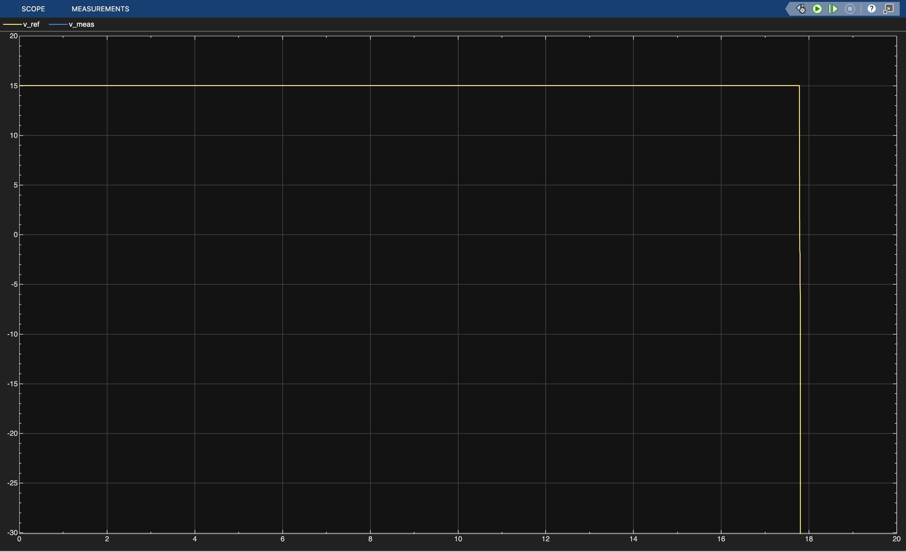
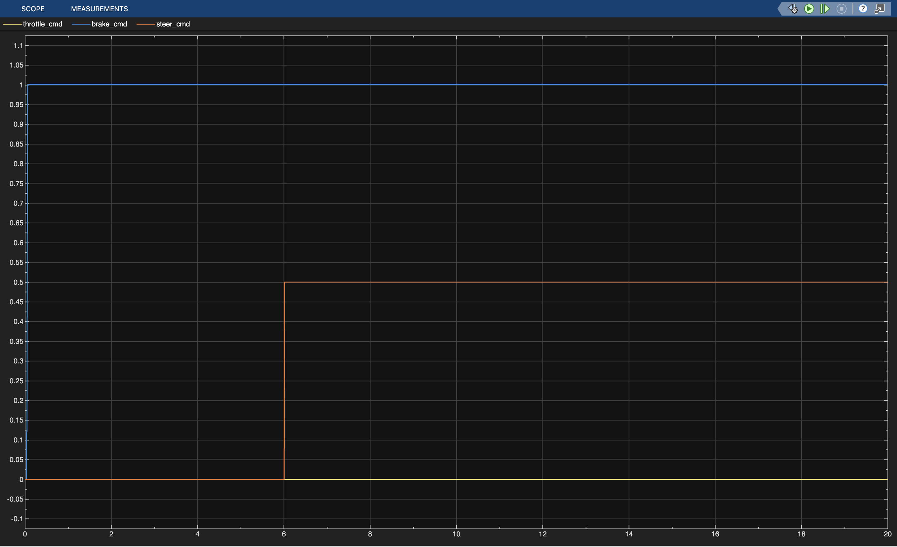
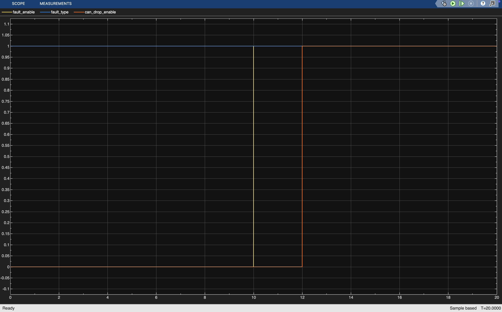
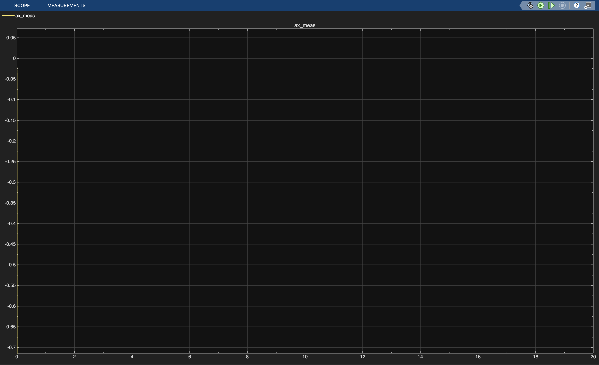

# Vehicle Control & CAN Fault Injection Simulation

A modular MATLAB/Simulink project that simulates an automotive vehicle control system with CAN network communication and fault injection. The system models ECU control logic, vehicle plant dynamics, CAN message latency, and fault scenarios such as packet drops and sensor failures.

This project builds an ECU-style Simulink simulation:
- Controller ECU computes drive/brake/steer commands
- Commands + sensor feedback are exchanged over a simulated CAN network
- Fault injection supported: sensor stuck/dropout, actuator delay, CAN drop
- Safety supervisor triggers safe-stop behavior when faults are detected

## Structure
- `model/` Simulink models (top model + subsystems)
- `scripts/` setup/run/plot scripts
- `data/` params + (optional) DBC files
- `results/` logs + plots
- `docs/` diagrams + test plan
## System Architecture

The system is organized into multiple subsystems to emulate a simplified automotive ECU network.

Scenario Generator
↓
ECU Controller
↓
CAN Network (Latency + Packet Drop)
↓
Vehicle Plant Model
↓
Sensor Bus Feedback
### Subsystems

**Scenario Generator**
- Generates reference commands and fault scenarios
- Provides speed reference, steering reference, and fault triggers

**ECU Controller**
- Computes throttle, brake, and steering commands
- Uses proportional control for speed and steering tracking

**CAN Network**
- Simulates CAN communication latency
- Supports packet-drop faults and message holding

**Vehicle Plant**
- Simulates vehicle dynamics including acceleration and steering behavior

**Fault Injection Monitor**
- Observes and validates fault behavior during simulation
## Vehicle Dynamics Model

The vehicle longitudinal motion is modeled using a simplified physics-based equation:

dv/dt = (F_drive - F_brake - c_rr - c_d * v²) / m

Where:

- F_drive = drive force generated by throttle
- F_brake = braking force
- c_rr = rolling resistance
- c_d v² = aerodynamic drag
- m = vehicle mass
Steering response is modeled using a first-order lag:

d(delta)/dt = (delta_cmd - delta) / tau_steer

Where:

- delta_cmd = commanded steering angle
- delta = measured steering angle
- tau_steer = steering actuator time constant
## Simulation Scenario

The simulation introduces command inputs and faults over time.

| Time (s) | Event |
|--------|------|
| 1 | Speed reference step to 15 m/s |
| 6 | Steering command step |
| 10 | Sensor fault enabled |
| 12 | CAN message drop activated |
## Simulation Results

### Speed Tracking

### Steering Response

### Controller Outputs

### Fault Activation

### Accelaration Response

## Technologies Used

- MATLAB
- Simulink
- Automotive control system modeling
- CAN communication simulation
- Git version control
## Project Structure

model/                → Simulink models  
scripts/              → MATLAB automation scripts  
data/params/          → system parameters  
docs/results/         → simulation screenshots  
