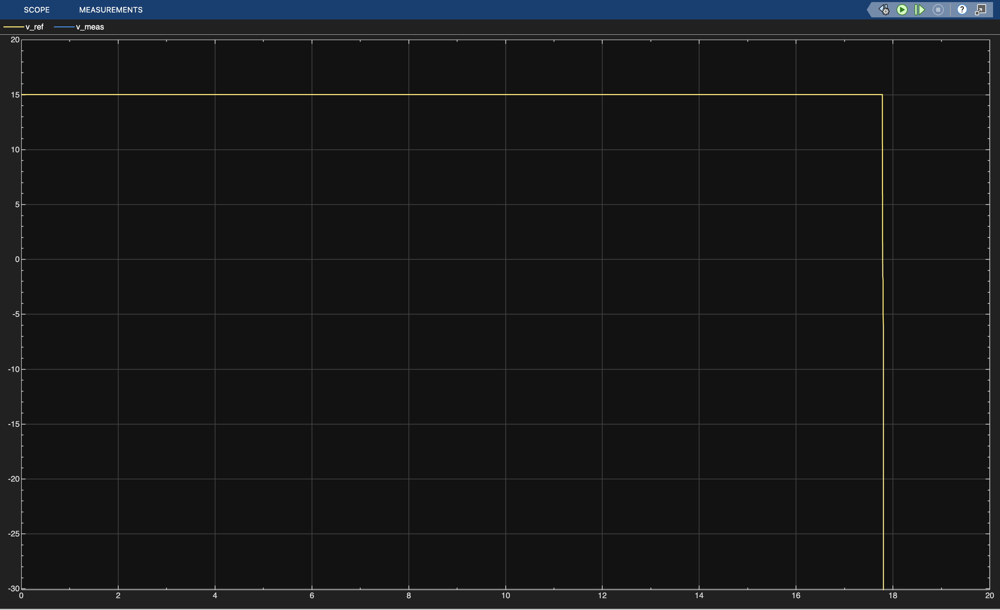
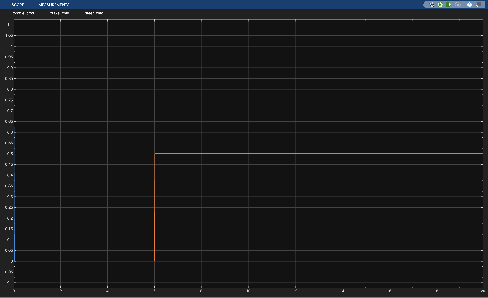
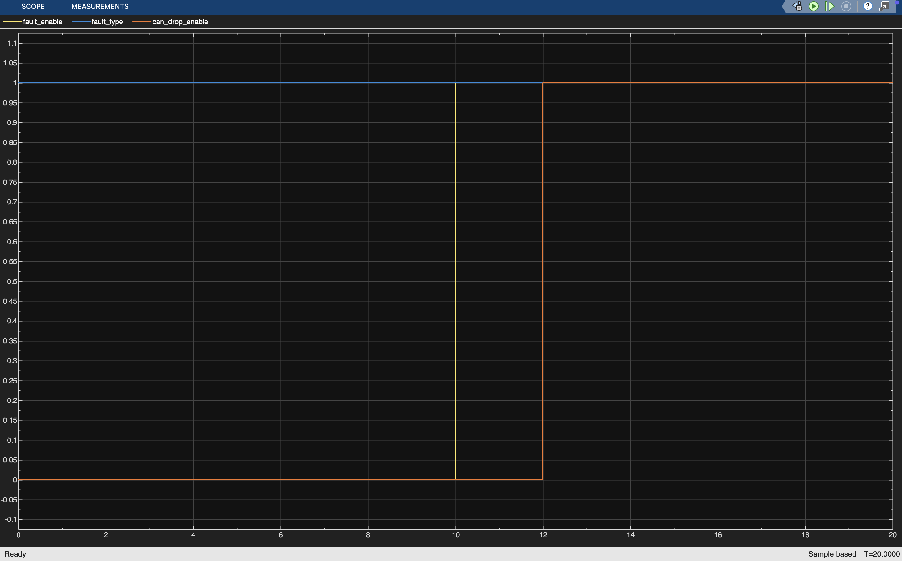
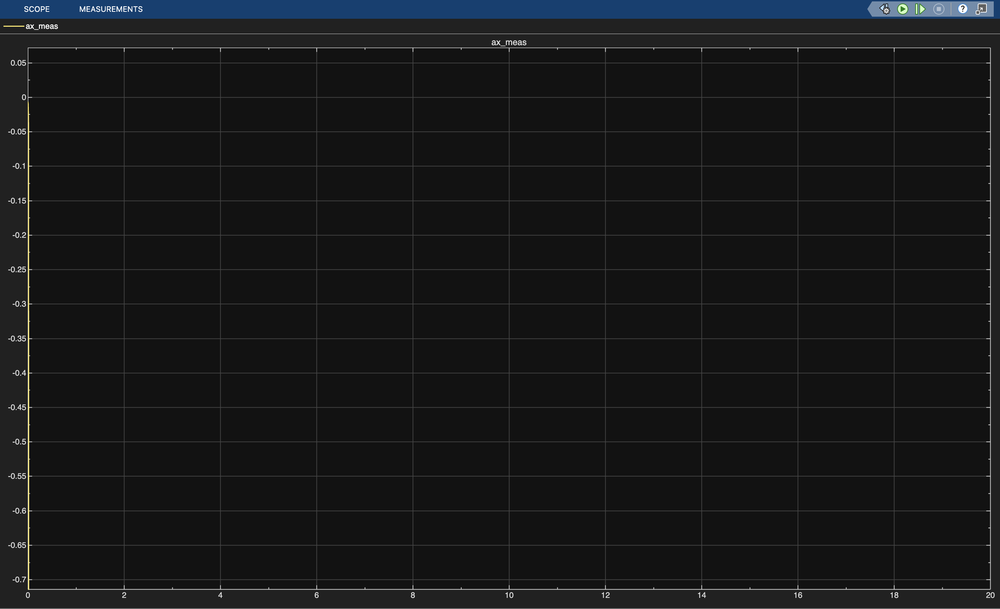

# Vehicle Control & CAN Fault Injection Simulation

A modular MATLAB/Simulink project that simulates an automotive vehicle control system with CAN network communication and fault injection. The system models ECU control logic, vehicle plant dynamics, CAN message latency, and fault scenarios such as packet drops and sensor failures.

This project builds an ECU-style Simulink simulation:
- Controller ECU computes drive/brake/steer commands
- Commands + sensor feedback are exchanged over a simulated CAN network
- Fault injection supported: sensor stuck/dropout, actuator delay, CAN drop
- Safety supervisor triggers safe-stop behavior when faults are detected

## Structure
- `model/` Simulink models (top model + subsystems)
- `scripts/` setup/run/plot scripts
- `data/` params + (optional) DBC files
- `results/` logs + plots
- `docs/` diagrams + test plan
## System Architecture

The system is organized into multiple subsystems to emulate a simplified automotive ECU network.

Scenario Generator
↓
ECU Controller
↓
CAN Network (Latency + Packet Drop)
↓
Vehicle Plant Model
↓
Sensor Bus Feedback
### Subsystems

**Scenario Generator**
- Generates reference commands and fault scenarios
- Provides speed reference, steering reference, and fault triggers

**ECU Controller**
- Computes throttle, brake, and steering commands
- Uses proportional control for speed and steering tracking

**CAN Network**
- Simulates CAN communication latency
- Supports packet-drop faults and message holding

**Vehicle Plant**
- Simulates vehicle dynamics including acceleration and steering behavior

**Fault Injection Monitor**
- Observes and validates fault behavior during simulation
## Vehicle Dynamics Model

The vehicle longitudinal motion is modeled using a simplified physics-based equation:

dv/dt = (F_drive - F_brake - c_rr - c_d * v²) / m

Where:

- F_drive = drive force generated by throttle
- F_brake = braking force
- c_rr = rolling resistance
- c_d v² = aerodynamic drag
- m = vehicle mass
Steering response is modeled using a first-order lag:

d(delta)/dt = (delta_cmd - delta) / tau_steer

Where:

- delta_cmd = commanded steering angle
- delta = measured steering angle
- tau_steer = steering actuator time constant
## Simulation Scenario

The simulation introduces command inputs and faults over time.

| Time (s) | Event |
|--------|------|
| 1 | Speed reference step to 15 m/s |
| 6 | Steering command step |
| 10 | Sensor fault enabled |
| 12 | CAN message drop activated |
## Simulation Results

### Speed Tracking

### Steering Response

### Controller Outputs

### Fault Activation

### Accelaration Response

## Technologies Used

- MATLAB
- Simulink
- Automotive control system modeling
- CAN communication simulation
- Git version control
## Project Structure

model/                → Simulink models  
scripts/              → MATLAB automation scripts  
data/params/          → system parameters  
docs/results/         → simulation screenshots  
# Vehicle Control & CAN Fault Injection Simulation (Advanced HIL-Oriented Framework)

A MATLAB/Simulink-based closed-loop vehicle control and communication simulation framework designed to emulate real-world automotive ECU validation environments. 

This advanced version extends the baseline model by incorporating structured fault injection, communication-level disturbances, and scenario-driven validation workflows aligned with industry HIL (Hardware-in-the-Loop) practices.

The project demonstrates controller robustness under sensor faults, CAN network impairments, and dynamic vehicle conditions, following V-cycle validation principles used in automotive ECU development.

---

## 🚀 Key Enhancements (Advanced Version)

- Scenario-driven simulation with time-based event triggering
- CAN network fault modeling (latency, packet drop, signal hold)
- Modular subsystem architecture aligned with ECU-based design
- Fault injection at sensor and communication levels
- Closed-loop feedback validation with monitoring signals
- Structured simulation outputs for analysis (logs + plots)
- Designed to mimic HIL test bench workflows (dSPACE-style abstraction)

---

## 📌 System Overview

This project models a complete closed-loop automotive control system:

- **ECU Controller** → Computes throttle, brake, and steering commands  
- **CAN Communication Layer** → Introduces latency, message drop, and delay effects  
- **Vehicle Plant Model** → Simulates longitudinal and lateral vehicle dynamics  
- **Fault Injection Module** → Injects sensor and network faults  
- **Monitoring & Logging System** → Tracks system response and fault propagation  

The system is designed to replicate real automotive ECU + HIL validation scenarios.

---

## 🧠 System Architecture
Scenario Generator
↓
ECU Controller
↓
CAN Network (Latency + Drop + Delay)
↓
Vehicle Plant Model
↓
Sensor Feedback + Fault Injection
↓
Monitoring & Logging

---

## 🔧 Subsystem Description

### Scenario Generator
- Generates reference inputs and fault trigger signals  
- Provides speed, steering, and time-based fault activation  

### ECU Controller
- Implements closed-loop control for speed and steering  
- Generates throttle, brake, and steering commands  

### CAN Network Module
- Simulates real-world communication behavior  
- Includes:
  - Message latency (transport delay)
  - Packet drop conditions
  - Signal holding / stale data behavior  

### Vehicle Plant Model
- Simulates vehicle longitudinal and lateral dynamics  
- Includes aerodynamic drag, rolling resistance, and actuator dynamics  

### Fault Injection Module
- Injects:
  - Sensor faults (bias / stuck / delay)
  - Communication faults (drop / delay)  
- Enables robustness testing of controller response  

### Monitoring & Logging
- Captures key signals:
  - Speed tracking
  - Steering response
  - Controller outputs
  - Fault activation flags  
- Supports validation and KPI analysis  

---

## ⚙️ Vehicle Dynamics Model

### Longitudinal Dynamics

dv/dt = (F_drive - F_brake - c_rr - c_d * v²) / m

### Steering Dynamics

d(delta)/dt = (delta_cmd - delta) / tau_steer

---

## 🧪 Simulation Scenario

| Time (s) | Event |
|--------|------|
| 1      | Speed step input (15 m/s) |
| 6      | Steering step command |
| 10     | Sensor fault injection |
| 12     | CAN message drop enabled |
## Simulation Results

### Speed Tracking

### Steering Response

### Controller Outputs

### Fault Activation

### Accelaration Response

---

## 📊 Results & Observations

- Stable speed tracking under nominal conditions  
- Degraded response under CAN latency and drop  
- Fault injection impacts closed-loop feedback behavior  
- Controller robustness evaluated under disturbance scenarios  

---

## 🛠️ Technologies Used

- MATLAB  
- Simulink  
- Control System Design  
- Automotive Communication (CAN concepts)  
- Model-Based Design (MBD)  
- Git / Version Control  

---

## 📁 Project Structure
model/ → Simulink models (top_model.slx + subsystems)
scripts/ → Simulation setup and automation scripts
data/ → Parameters and optional DBC files
results/ → Logs and output plots
docs/ → Architecture diagrams and validation notes
---

## 🎯 Industry Relevance

This project is aligned with real-world automotive validation workflows:

- ECU functional validation (SIL/HIL concepts)  
- CAN communication fault testing  
- Model-based development (V-cycle alignment)  
- Fault injection testing (robustness & edge cases)  

---

## 📌 Future Improvements

- Integration with real CAN tools (Vector / CANalyzer)  
- dSPACE / HIL deployment compatibility  
- Advanced controller design (PID / MPC)  
- Automated test execution (Python / AutomationDesk style)  
- DBC-based signal decoding  

---
